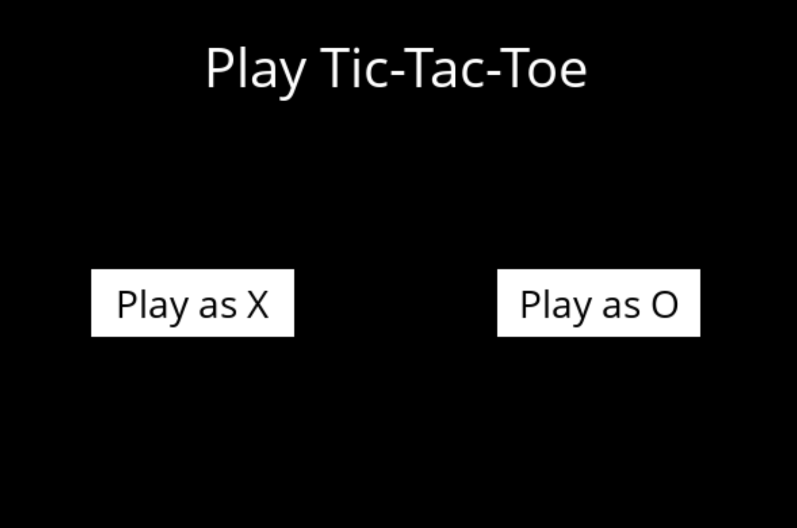
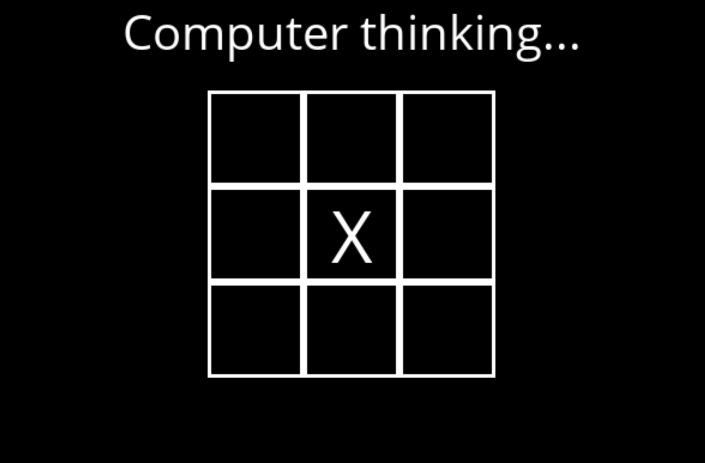

# Tic-Tac-Toe-AI

What I learned and what I can further learn:
- Pygame which is basically a Python GUI for creating video games
- How to implement a simple AI using the Minimax algorithm
- Alpha-beta pruning can be used to decrease the number of nodes that are evaluated by the minimax algorithm in the search tree

Notes:
- For Python 3.11, type ```pip install pygame --pre``` to install Pygame
- Run ```python runner.py``` to play with the intelligent system
    - In VS Code,run (on the dropdown tab) the Python file (not code)
    - In PyCharm, run ```& C:/Users/jaide/AppData/Local/Programs/Python/Python311/python.exe c:/dev/Projects/tictactoe/runner.py```

Images:






References:
- https://gsurma.medium.com/tic-tac-toe-creating-unbeatable-ai-with-minimax-algorithm-8af9e52c1e7d
- https://www.javatpoint.com/mini-max-algorithm-in-ai
